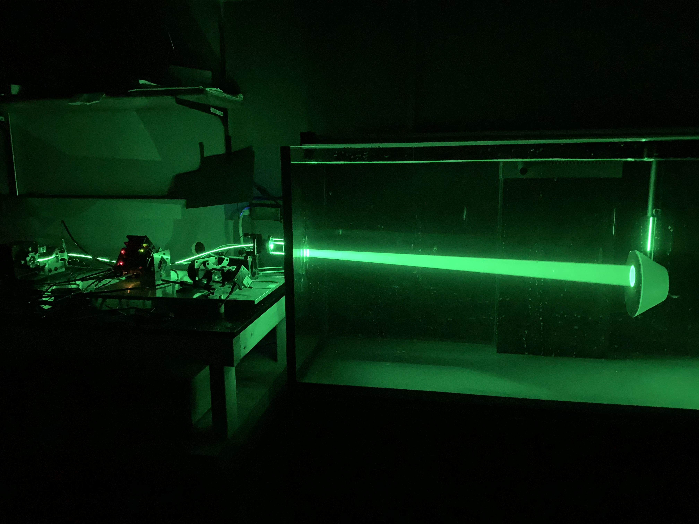
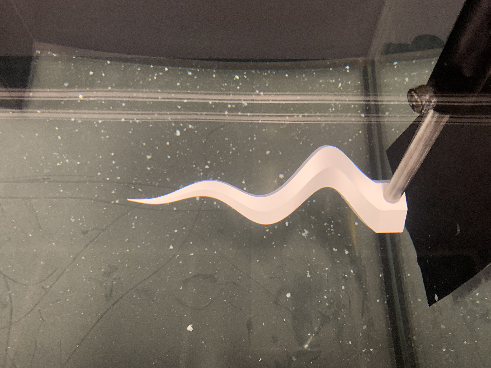
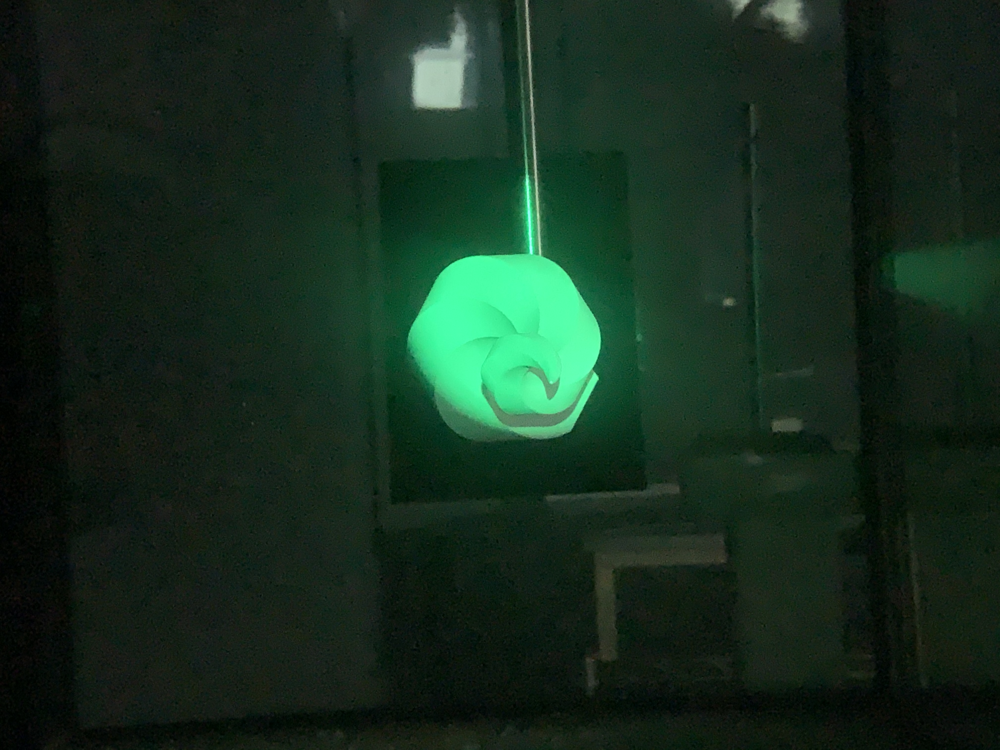
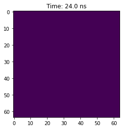

This imager is the result of efforts to reduce costs in 3D perception systems by concentrating all light sensing capabilities into one single pixel. A clever implementation of a DMD, along with image capturing discretazion across time rather than space, as is conventional in multi-pixel imaging arrays. This imager was designed to produce compressed, computer vision images specific, at up to 108 Hz. Laser pulse returns were captured by the single pixel to build up complex 3-dimensional images of underwater objects, as seen in the pictures below.

